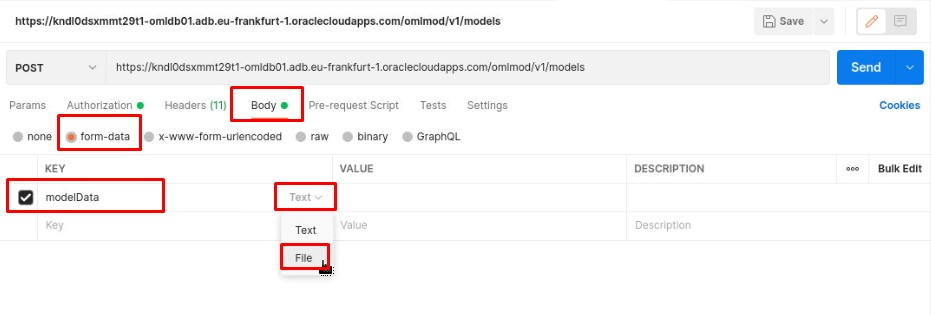
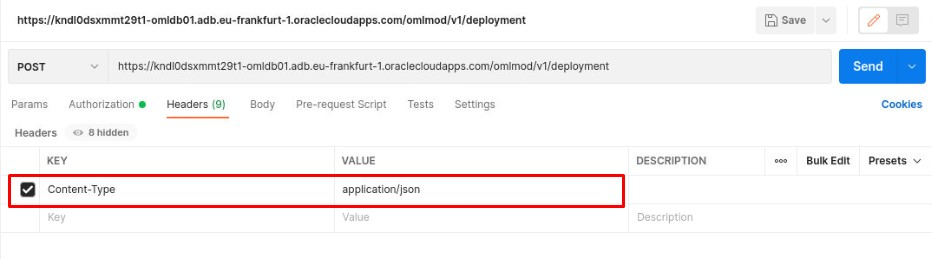
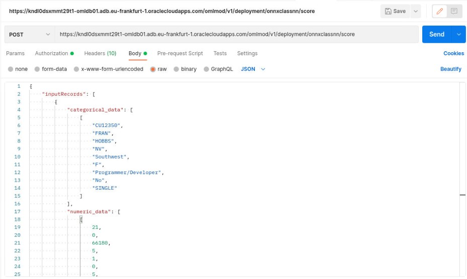
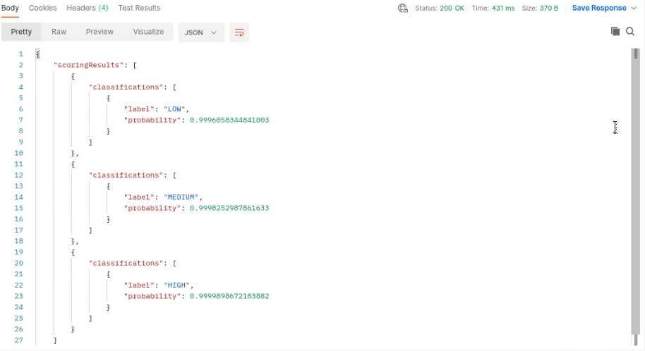

# Loading an ONNX model and score it using OML Services


In this section of the workshop we will import a Neural Network model saved on ONNX format in our Autonomous Database and score it using OML Services REST APIs

The ONNX model is already pre-build and on the VM. To create it we ran the following steps:
*  create a pipeline to process the columns. We are putting first the character columns named ``categorical_data`` and after the numeric columns named ``numeric_data``. The categorical columns are encoded with OneHotEncoder.

      ``
      preprocessor = ColumnTransformer(
          transformers=[
              ('num', numeric_transformer, numeric_feat_index),
              ('cat', categorical_transformer, categorical_feat_index)
          ])
      ``

* define the Neural Network classification model using SKlearn:

      ``classifier = MLPClassifier(random_state=1, max_iter=300)``
* create the model from the pipeline

      ``model = Pipeline(steps=[
          ('preprocessor', preprocessor),
          ('classifier', classifier)
      ])``

* create the onnx model from the pipeline:

  When converting a model to ONNX, the initial types are required. sklearn does not store information about the training data, so it is not always possible to retrieve the number of features or their types. For this reason, convert\_sklearn contains an argument called initial\_types to define the model input types.

      ``initial_types = [('categorical_data', StringTensorType(shape=[None, 9])),
          ('numeric_data', FloatTensorType([None, 20]))]
      ``

  Convert the model:

      ``onnxclassnn = convert_sklearn(model,initial_types=initial_types,target_opset=12)``

      ``onnxmltools.utils.save_model(onnxclassnn, 'onnxclassnn.onnx')``

* create the metadata.json file containing the function description.

      ``metadata = {"function": "classification", "classificationProbOutput": "output_probability"}``
      ``with open('metadata.json', mode='w') as f:
          json.dump(metadata, f)``

* save all in the zip archive

      ``with ZipFile('onnx_class_NN.model.zip', mode='w') as zf:
          zf.write('metadata.json')
          zf.write('onnxclassnn.onnx')``


With the **``onnx_class_NN.model.zip``** in place we will load it in the Autonomous Database repository and score customers against it.


Estimated Time: 20 minutes

### Objectives
We are going to run the next steps:
* Store the model in the OML Services repository;
* Deploy the model;
* Score a customer using the Neural Network model;


### Prerequisites
* Autonomous Database created
* OML user created in Autonomous database
* ``onnx_class_NN.model.zip`` file on the VM.

## 
## Task: 1: List the models in the OML Services repository

*  In the Postman session opened run the Get method to get the list of models deployed.

    ````
    Operation: GET

    URI endpoint:
    <copy>https://<oml-cloud-service-location-url>.oraclecloudapps.com/omlmod/v1/models</copy>

    ````
    - Replace **`<oml-cloud-service-location-url>`** with your URL saved in chapter "Scoring OML model using OML Services" Task 1.2: Authorize OML Services User

    In the Authorization tab pick **Bearer Token** and paste the token copied from *Scoring OML using OML Services Task 1*.
    

    The response is with both the Decistion Tree Model **DTModel** and the Support Vector Machine model **SVMG** model we created and scored in our previous tasks.
    

    In case you get the Expired Token Error, rerun the generate Token command explained in **Scoring OML using Rest Services: Task 1**.


## Task: 2: Store an ONNX model in the OML Services repository

* Open a new tab in Postman and run the following POST command to load the model in Autonomous Database.

````
Operation: POST

URI endpoint:
<copy>https://<oml-cloud-service-location-url>.oraclecloudapps.com/omlmod/v1/models</copy>

````
 - Replace **`<oml-cloud-service-location-url>`** with your URL saved

 In the Authorization tab pick **Bearer Token** and the token is pre-filled.

 

In the Headers tab enter the following:

````
Content-Type: multipart/form-data
boundary: Boundary
````

  


In the Body tab pick form-data and enter `modelData` in the key field, hover over the right side of the field and pick File in the dropdown.

  

Click Select File; go to `/home/oracle/OML-Services/` folder and select the **`onnx_class_NN.model.zip`** file created earlier.

  

Add the next keys in the Body tab and click Send.

````
 modelName=onnxclassnn
 modelType=ONNX
 version=1.0
 namespace=ONNX_MODELS
````
  

The response is that the model is created.

 

Copy the **`modelId`** displayed in the JSON response.


## Task: 3: Deploy the model

* Open a new tab in Postman and run the following POST command to deploy the model in Autonomous Database.

````
Operation: POST

URI endpoint:
<copy>https://<oml-cloud-service-location-url>.oraclecloudapps.com/omlmod/v1/deployment</copy>

````
 - Replace **`<oml-cloud-service-location-url>`** with your URL saved


In the Authorization tab pick **Bearer Token** and the token is pre-filled.

    

In the Headers tab enter the following:

````
Content-Type: application/json
````

  

 In the Body tab enter the following JSON:

````
<copy>{
	"modelId": "feea5ebd-17a1-4502-843b-3f1a624d1fdd",
	"uri":"onnxclassnn"
}</copy>
````

Where `feea5ebd-17a1-4502-843b-3f1a624d1fdd` is the model Id copied from the previous step. Replace it with the returned model Id from your previous command.

The URI **`onnxclassnn`** we are going to use for scoring the data against our model.

  

And the result is:

 

The next step is to score a customer.


## Task: 4: Score a customer using ONNX Neural Network Model

In this step we are going to score Fran Hobbs against our Neural Network imported model.

Enter the following details:

````
Operation: POST

URI endpoint:
<copy><oml-cloud-service-location-url>.oraclecloudapps.com/omlmod/v1/deployment/<model_URI>/score </copy>
````
 - Replace **`<oml-cloud-service-location-url>`** with your URL saved
 - Replace **`<model_URI>`** with the model URI that we defined in previous task: **`onnxclassnn`**

In the Authorization tab pick **Bearer Token** and the token is pre-filled.

   


In the header Tab enter the details:

````
--header 'Content-Type: application/json'

````

    


In the Body tab enter the Fran Hobs data in RAW format. We are providing the data in the format that this specific ONNX model expects it: first the character columns named ``categorical_data`` and after the numeric columns named ``numeric_data``. In this case we may skip the column names also. So the record for FRAN HOBBS is transformed from:

```{
   "CUST_ID":"CU12350",
   "LAST":"FRAN",
   "FIRST":"HOBBS",
   "STATE":"NV",
   "REGION":"Southwest",
   "SEX":"F",
   "PROFESSION":"Programmer/Developer",
   "BUY_INSURANCE":"No",
   "AGE":21,
   "HAS_CHILDREN":0,
   "SALARY":66180,
   "N_OF_DEPENDENTS":5,
   "CAR_OWNERSHIP":1,
   "HOUSE_OWNERSHIP":0,
   "TIME_AS_CUSTOMER":5,
   "MARITAL_STATUS":"SINGLE",
   "CREDIT_BALANCE":0,
   "BANK_FUNDS":500,
   "CHECKING_AMOUNT":185,
   "MONEY_MONTLY_OVERDRAWN":53.21,
   "T_AMOUNT_AUTOM_PAYMENTS":197,
   "MONTHLY_CHECKS_WRITTEN":4,
   "MORTGAGE_AMOUNT":0,
   "N_TRANS_ATM":3,
   "N_MORTGAGES":0,
   "N_TRANS_TELLER":2,
   "CREDIT_CARD_LIMITS":2500,
   "N_TRANS_KIOSK":4,
   "N_TRANS_WEB_BANK":0
}
```

To:

```
<copy>
{
    "inputRecords": [
        {
            "categorical_data": [
                [
                    "CU12350",
                    "FRAN",
                    "HOBBS",
                    "NV",
                    "Southwest",
                    "F",
                    "Programmer/Developer",
                    "No",
                    "SINGLE"
                ]
            ],
            "numeric_data": [
                [
                    21,
                    0,
                    66180,
                    5,
                    1,
                    0,
                    5,
                    0,
                    500,
                    185,
                    53.21,
                    197,
                    4,
                    0,
                    3,
                    0,
                    2,
                    2500,
                    4,
                    0
                ]
            ]
        }
    ]
}
</copy>
```

Notice that we are still not providing any of the ``LTV`` or ``LTV_BIN`` data, but provide fully the other important data.


Click Send

    

Notice the response for this scoring.

    

In this case the percentages are different but it still has the highest probability to be in the **LOW** category as it was in our previous models.


## Task: 5: Score multiple customers using ONNX Neural Network Model

In this step we are going to score all three customers against our Neural Network imported model.

Enter the following details:

````
Operation: POST

URI endpoint:
<copy><oml-cloud-service-location-url>.oraclecloudapps.com/omlmod/v1/deployment/<model_URI>/score </copy>
````
 - Replace **`<oml-cloud-service-location-url>`** with your URL saved
 - Replace **`<model_URI>`** with the model URI that we defined in previous task: **`onnxclassnn`**


In the Authorization tab pick **Bearer Token** and the token is pre-filled.

   


In the header Tab enter the details:

````
--header 'Content-Type: application/json'

````

    


In the Body tab we are providing the data in the format with ``categorical_data`` and ``numeric_data`` for all 3 customers.


```
<copy>
{"inputRecords": [{"categorical_data": [["CU12350", "FRAN", "HOBBS", "NV", "Southwest", "F","Programmer/Developer", "No", "SINGLE"]],
"numeric_data":[[21,0, 66180, 5,1, 0, 5, 0, 500, 185, 53.21, 197,  4, 0, 3, 0,  2, 2500,4,0]]},
{"categorical_data": [["CU12331", "AL", "FRANK", "WA", "West", "M","Programmer/Developer", "No", "SINGLE"]],
"numeric_data":[[21, 0, 75415, 3, 1, 0, 3, 0, 250, 25, 53.06, 257, 0, 0, 0, 0, 2, 1500, 4, 0]]},
{"categorical_data": [["CU12286", "ELLIOT", "PADGETT", "NV", "Southwest", "M","Programmer/Developer", "Yes", "SINGLE"]],
"numeric_data":[[23, 0, 69724, 3, 1, 1, 3, 0, 500, 81, 52.96, 164, 4, 250, 2, 1, 2, 1500, 4, 250]]}
]
,"topN":1 }
</copy>
```


Here, topN filters the classification result showing the N highest probabilities, as shown in the scoring results below:

Click Send

    

Notice the response for this scoring.

    

The percentages may be different but the groups to which the customers are assigned are the same as with the SVMG and Decision Tree models.


## Acknowledgements
* **Authors** -  Andrei Manoliu, Milton Wan
* **Contributors** - Rajeev Rumale
* **Last Updated By/Date** -  Andrei Manoliu, December 2021

## Need Help?
Please submit feedback or ask for help using our [LiveLabs Support Forum](https://community.oracle.com/tech/developers/categories/livelabsdiscussions). Please click the **Log In** button and login using your Oracle Account. Click the **Ask A Question** button to the left to start a *New Discussion* or *Ask a Question*.  Please include your workshop name and lab name.  You can also include screenshots and attach files.  Engage directly with the author of the workshop.

If you do not have an Oracle Account, click [here](https://profile.oracle.com/myprofile/account/create-account.jspx) to create one.
