# Creating models using OML Notebooks and OML AutoML UI

In this section we will connect to OML Notebooks and split the data in train and test chunks. We will use the train data to run the OML AutoML UI and create a good model to make our prediction. We will deploy the model for use with OML Services REST endpoints in the next sections.

Estimated Time: 15 minutes

### Objectives

* Use OML AutoML UI to create the models
* See the models created and Deploy one

### Prerequisites
* Autonomous Database created
* OML user created
* Data loaded in the database


##                                           

## Task 1: Connect to OML Notebooks and display Insurance Customer Data

* In the Autonomous Database instance details page. Click on the Service Console button.
  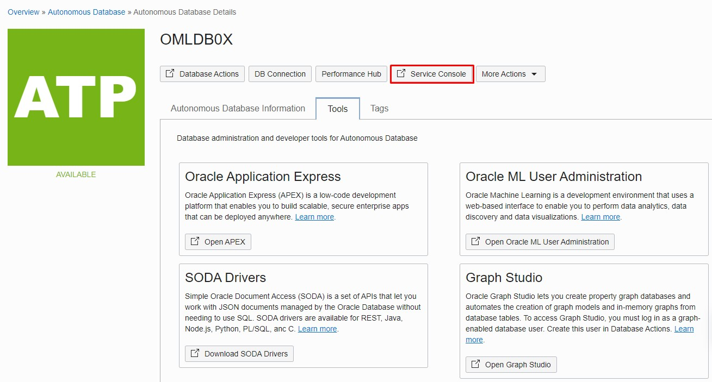

* A new page with the service console is opened. In the Overview section we see the details of this specific instance. We can go to the Development section in the left side.
  


* Click on **Oracle Machine Learning User Interface**.
  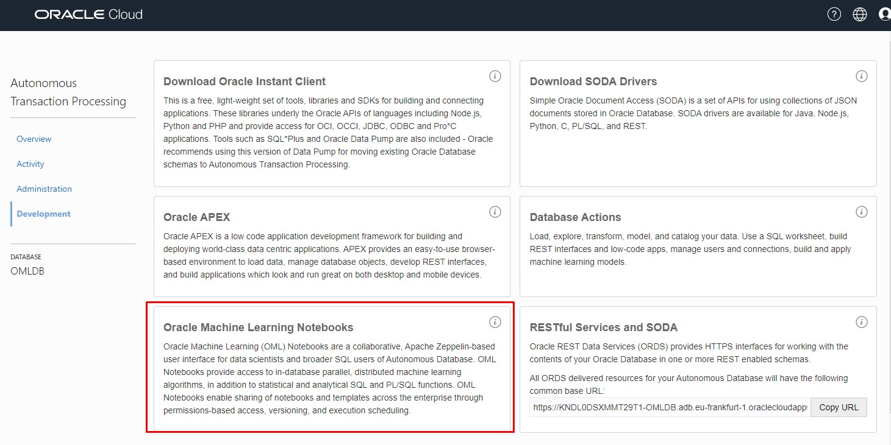

* Login to OML Machine Learning User Interface in Autonomous Database

  Access the Oracle Machine Learning Notebooks link and connect with the credentials that we created earlier. In our case the credentials are:
    - Username: **OMLUSER**
    - Password: **Welcome12345**

   

* Open a Scratchpad

  


* The notebook server is starting. Once opened we can run a select on the ``CUSTOMER_INSURANCE`` table
    ````
    <copy> select * from customer_insurance;  </copy>
    ````

    

 Notice the columns ``LTV`` and ``LTV_BIN`` when you scroll to the right. These are our targets for the machine learning.

 * Drop training and test tables if they exist

     ````
     <copy> %script
     DROP TABLE Customer_insurance_train_classification;

     DROP TABLE Customer_insurance_test_classification;
     </copy>
     ````
     

     If the tables don't exist, the script will return an error. We will create the tables in the next steps

  * Create the training table for our AutoML UI

     ````
     <copy>
     %script
     create table Customer_insurance_train_classification as
     select CUST_ID,"LAST","FIRST","STATE","REGION","SEX","PROFESSION","BUY_INSURANCE","AGE","HAS_CHILDREN","SALARY","N_OF_DEPENDENTS","CAR_OWNERSHIP","HOUSE_OWNERSHIP","TIME_AS_CUSTOMER","MARITAL_STATUS","CREDIT_BALANCE","BANK_FUNDS","CHECKING_AMOUNT","MONEY_MONTLY_OVERDRAWN","T_AMOUNT_AUTOM_PAYMENTS","MONTHLY_CHECKS_WRITTEN","MORTGAGE_AMOUNT","N_TRANS_ATM","N_MORTGAGES","N_TRANS_TELLER","CREDIT_CARD_LIMITS","N_TRANS_KIOSK","N_TRANS_WEB_BANK", "LTV","LTV_BIN"
     from customer_insurance
     SAMPLE (70) SEED (1)
     where cust_id not in ('CU12350','CU12331', 'CU12286')
     </copy>
     ````
     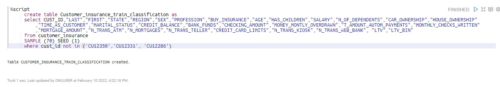

     Notice that we keep the ``LTV_BIN`` column to be the target for our supervised learning classification model.
      For this particular workshop we exclude 3 specific customers so we will score 3 different models using their data.


 * Create the test table for our Auto ML UI

     ````
     <copy>%script
     create table Customer_insurance_test_classification as
     select CUST_ID,"LAST","FIRST","STATE","REGION","SEX","PROFESSION","BUY_INSURANCE","AGE","HAS_CHILDREN","SALARY","N_OF_DEPENDENTS","CAR_OWNERSHIP","HOUSE_OWNERSHIP","TIME_AS_CUSTOMER","MARITAL_STATUS","CREDIT_BALANCE","BANK_FUNDS","CHECKING_AMOUNT","MONEY_MONTLY_OVERDRAWN","T_AMOUNT_AUTOM_PAYMENTS","MONTHLY_CHECKS_WRITTEN","MORTGAGE_AMOUNT","N_TRANS_ATM","N_MORTGAGES","N_TRANS_TELLER","CREDIT_CARD_LIMITS","N_TRANS_KIOSK","N_TRANS_WEB_BANK","LTV","LTV_BIN"
     from customer_insurance
     minus
     select CUST_ID,"LAST","FIRST","STATE","REGION","SEX","PROFESSION","BUY_INSURANCE","AGE","HAS_CHILDREN","SALARY","N_OF_DEPENDENTS","CAR_OWNERSHIP","HOUSE_OWNERSHIP","TIME_AS_CUSTOMER","MARITAL_STATUS","CREDIT_BALANCE","BANK_FUNDS","CHECKING_AMOUNT","MONEY_MONTLY_OVERDRAWN","T_AMOUNT_AUTOM_PAYMENTS","MONTHLY_CHECKS_WRITTEN","MORTGAGE_AMOUNT","N_TRANS_ATM","N_MORTGAGES","N_TRANS_TELLER","CREDIT_CARD_LIMITS","N_TRANS_KIOSK","N_TRANS_WEB_BANK","LTV","LTV_BIN"
      from Customer_insurance_train_classification
     </copy>
     ````
     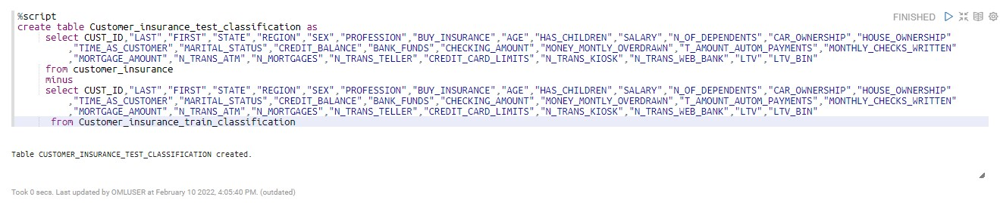

     Notice that in the testing table we will not use any of the leading ``LTV`` or ``LTV_BIN`` columns. These column might be misleading in the process. We will still use them in our verification process.

## Task 2: Use OML AutoML UI from Oracle Autonomous Database

* Go to the Main menu on the top left side near the Oracle Machine Learning icon.


* Choose AutoML.
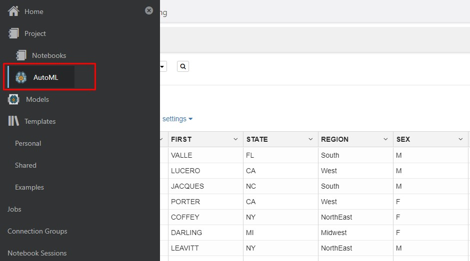


* Click Create in the AutoML Experiments page


* In the Create Experiment page choose the following details:

    - Name: **AutoML Classification**
    - Data Source: chose the **CUSTOMER\_INSURANCE\_TRAIN\_CLASSIFICATION** table in the OMLUSER schema.
    - Predict: **LTV_BIN**
    - Prediction Type: **CLASSIFICATION**
    - Case ID: **CUST_ID**

    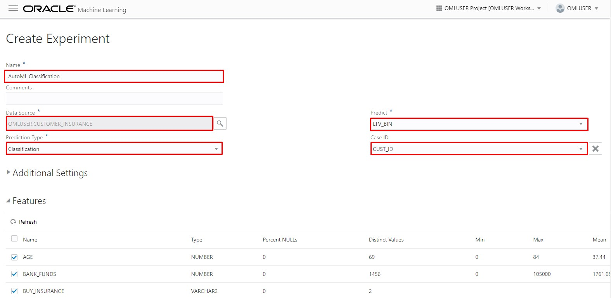

* To make some customizations you can expand the Additional Settings menu

    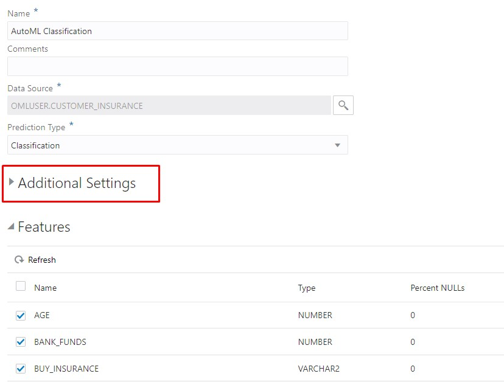

    Notice that we can set the Database Service Level to High, and select by which metric we should compare the models, and which predefined algorithms to include or exclude from this experiment.

      - Choose the following options for your experiment:

        - Database Service Level: **High**
        - Model Metric: **BALANCED ACCURACY**


    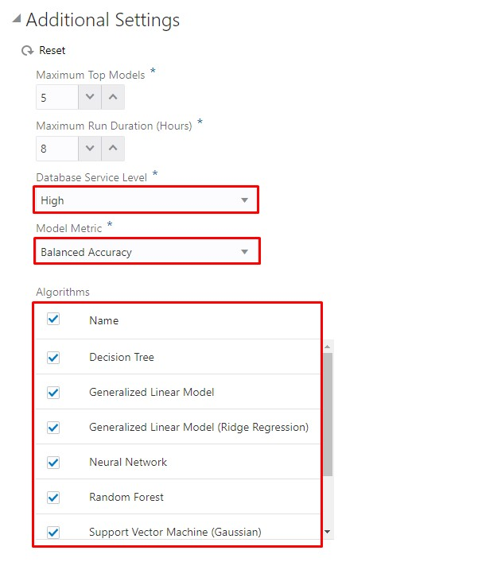


* In the **Features** section, we can deselect the following columns:
    - First
    - Last
    - LTV

  In most cases the name of the candidate should not be a deciding factor so we will remove them from the model features. Also LTV column which is a computational numeric column that drive the LTV_BIN column might be missdirecting the model and this column is removed also.
  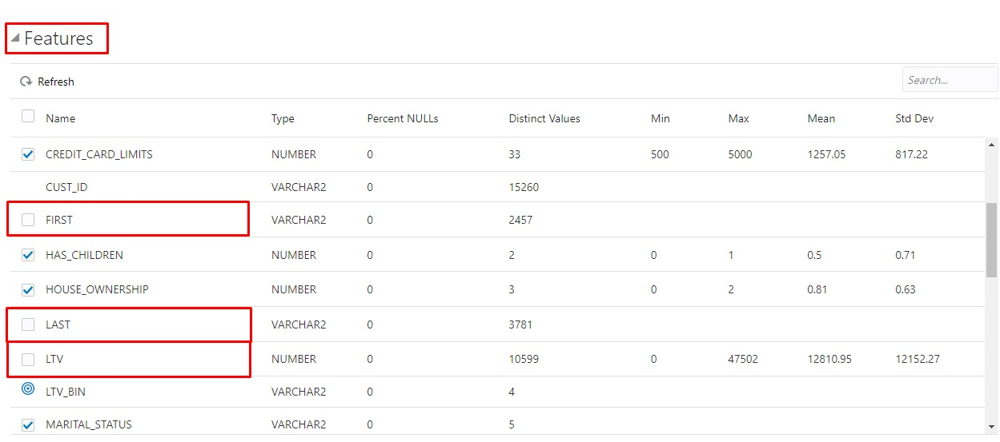

* Run OML Auto ML experiment by clicking **```Start```** and **```Better Accuracy```**.
  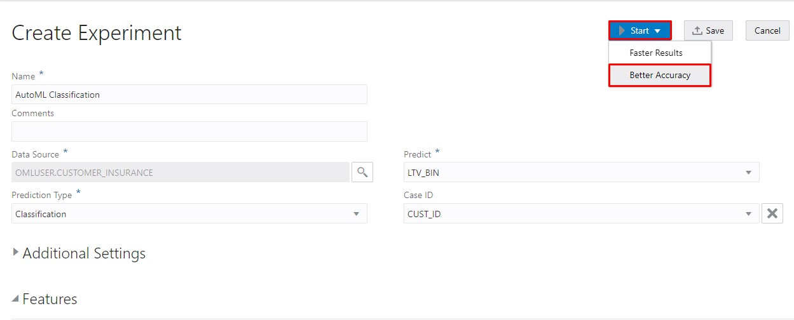

  The AutoML Classification will run for several minutes showing which top 5 algorithms have a Better Accuracy. The running process takes around 20 minutes.

* And the result of the experiment
  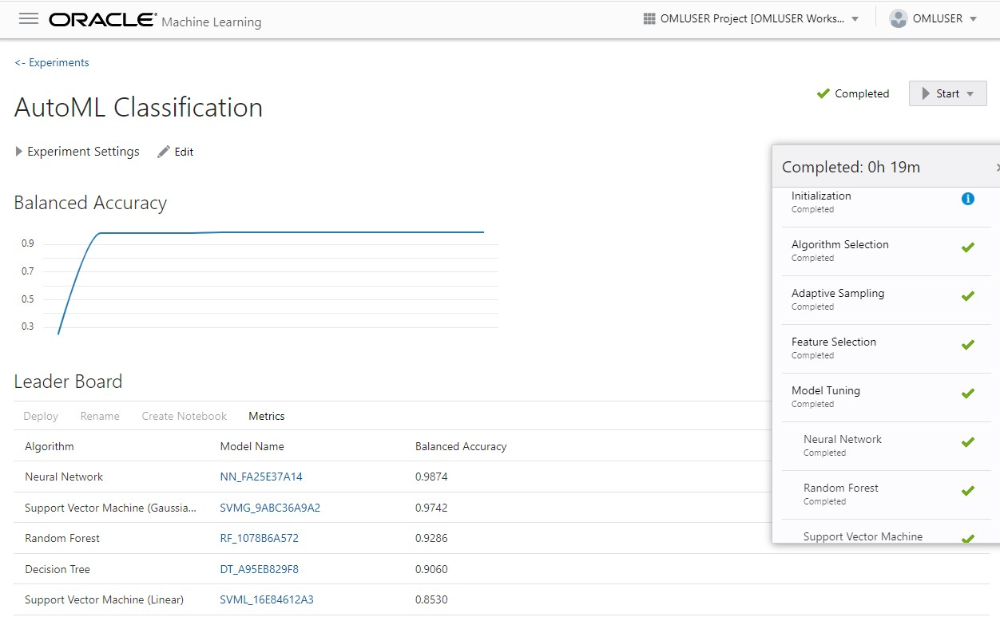

  Each model described here is based on one of the automatically selected algorithms. Select the **Support Vector Machine (Gaussian)** algorithm and click on the model name which starts with **SVMG_**.

  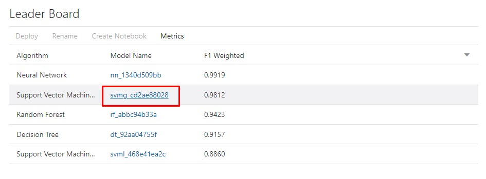

  The model detail window opens and the first tab is Prediction Impacts.

  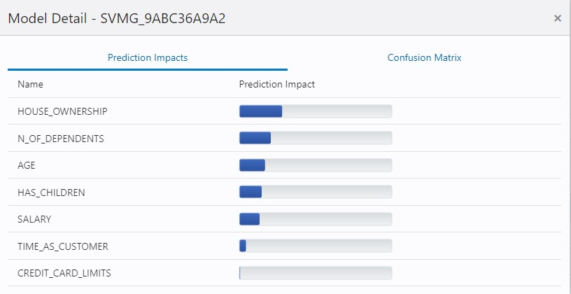

  Notice how the other predictor columns impact our model differently and which columns have a higher weight. We can click on the Confusion Matrix tab.

  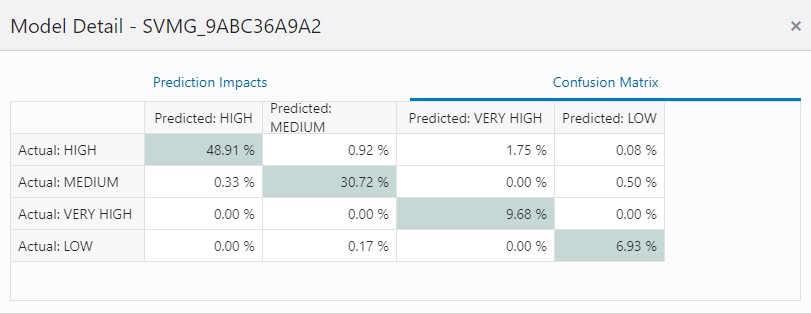

  There we can see for each class: **LOW**, **MEDIUM**, **HIGH**, **VERY HIGH** what percentage of customers correctly predicted for each combination of actual and predicted values.


* We can rename the Support Vector Machine model so it would be easier to recognize in the next sections. For this we can select the model and click on the Rename button.

  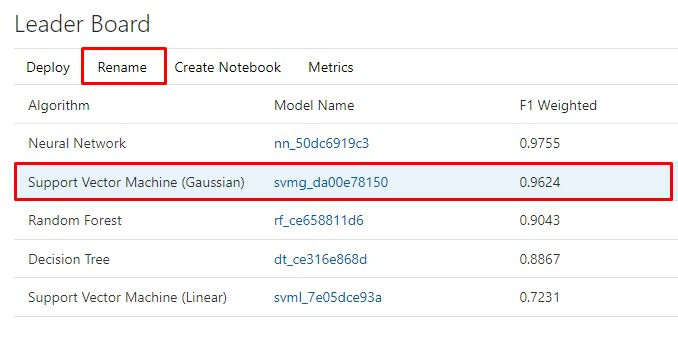

* Enter a new Model Name and click OK. In our case we are going to use **SVMG**.

  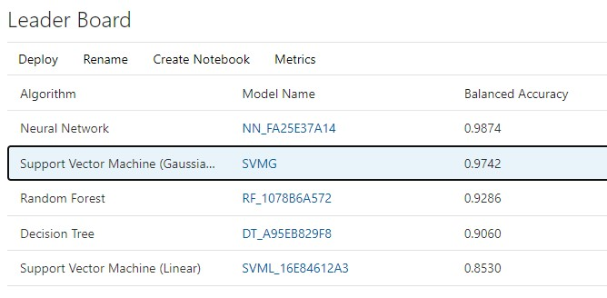

* The model is now renamed in the Leader Board.

  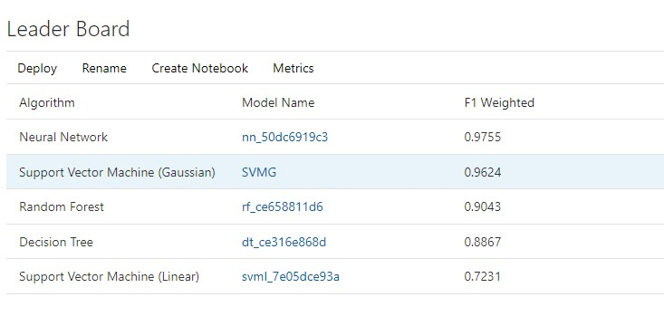

* The next steps are to deploy the model for OML Services for access via Rest endpoints. Click on the Deploy button.

  

  Enter the following details.


    - Name: is prefilled with the Model name.
    - URI: choose a specific URI, for example: **classsvmg**
    - Version: **1**
    - Namespace: OML


  Copy the Model URI in a accessible place because we are going to use it in the next sections of the workshop.
  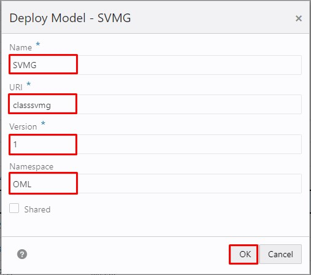

  Click OK.

  We have a confirmation that the model was deployed successfully.
  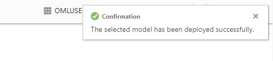

## Task 3: Verify the model deployment.


* Go to the Main menu on the top left side near the Oracle Machine Learning icon.
  

* Choose Models.
  

* We see the list of models created by the AutoML UI with their specific algorithm and target value.
  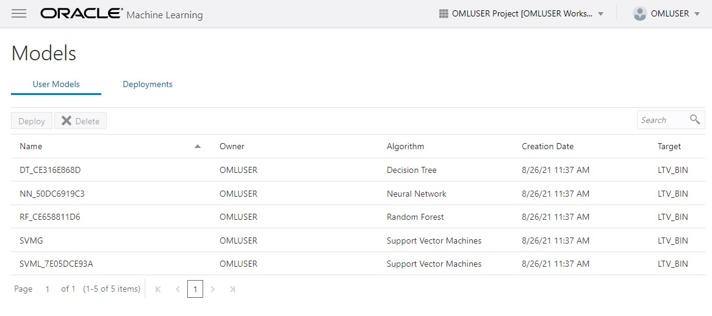


* In the Deployment tab you can see the model and URI

  

  We can now use REST APIs to query the model, model scoring and scoring for specific data.


## Task 4: Score data against the model using SQL

  * Return to the OML Notebooks Scratchpad we created earlier. Click on the menu and chose Notebooks.
  


  * Click on the Scratchpad notebook.
    


  * Run the following SQL statement using the ``CUST_IDs`` we picked in the train test split. You can replace the model name with the one used previously.

     ````
     <copy>%sql
         SELECT a.cust_id,
               a. Last,
               a.First,
               PREDICTION(SVMG USING a.*) PREDICTION,
               PREDICTION_PROBABILITY(SVMG USING a.*)  PREDICTION_PROBABILITY,
               b.LTV_BIN
         FROM Customer_insurance_test_classification a,
         Customer_insurance b
        where a.cust_id = b.cust_id
        and b.cust_id in ('CU12350','CU12331', 'CU12286')
     </copy>
     ````

  

 The SQL statement returns the most probable group or class for the data provided in the column PREDICTION with it’s corresponding prediction probability for each of the customers selected. In out case the prediction is the same as the actual ``LTB_BIN`` column in ``CUSTOMER_INSURANCE`` initial table.

* Run the following SQL statement to compare the model predicted value with the actual value in the testing table.

    ````
    <copy>%sql
          SELECT a.cust_id,
                 a.Last,
                 a.First,
                 PREDICTION(SVMG USING a.*) PREDICTION,
                 b.LTV_BIN
          FROM Customer_insurance_test_classification a,
          Customer_insurance b
           where a.cust_id = b.cust_id and a.last = b.last
    </copy>
    ````

    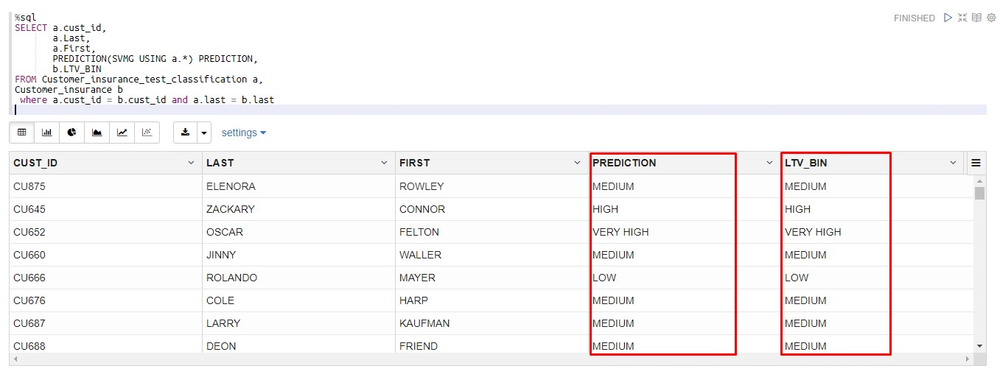

 The SQL statement returns the most probable group or class for the data provided in the column ``PREDICTION`` compared with the column ``LTV_BIN`` from the initial table.


## Acknowledgements
* **Authors** -  Andrei Manoliu, Milton Wan
* **Contributors** - Rajeev Rumale
* **Last Updated By/Date** -  Andrei Manoliu, December 2021

## Need Help?
Please submit feedback or ask for help using our [LiveLabs Support Forum](https://community.oracle.com/tech/developers/categories/livelabsdiscussions). Please click the **Log In** button and login using your Oracle Account. Click the **Ask A Question** button to the left to start a *New Discussion* or *Ask a Question*.  Please include your workshop name and lab name.  You can also include screenshots and attach files.  Engage directly with the author of the workshop.

If you do not have an Oracle Account, click [here](https://profile.oracle.com/myprofile/account/create-account.jspx) to create one.
