# Creating models using OML Notebook and AutoML UI

In this section we will connect to OML notebooks and split the data in train and test chunks. We will use the train data to run the AutoML UI and create a good model to make our prediction. The model we will deploy it to be used with rest services in the next sections.

Estimated Time: 15 minutes

### Objectives

* Create an OML Notebook
* Split the data into Train and Test Data
* Use AutoML UI to create the models
* See the models created and Deploy one


### Prerequisites
* Autonomous Database created
* Data loaded in the database
* OML user created

##                                           

## Task 1: Introduce Insurance Customer Data

* In the Autonomous Database instance details page. Click on the Service Console button.
  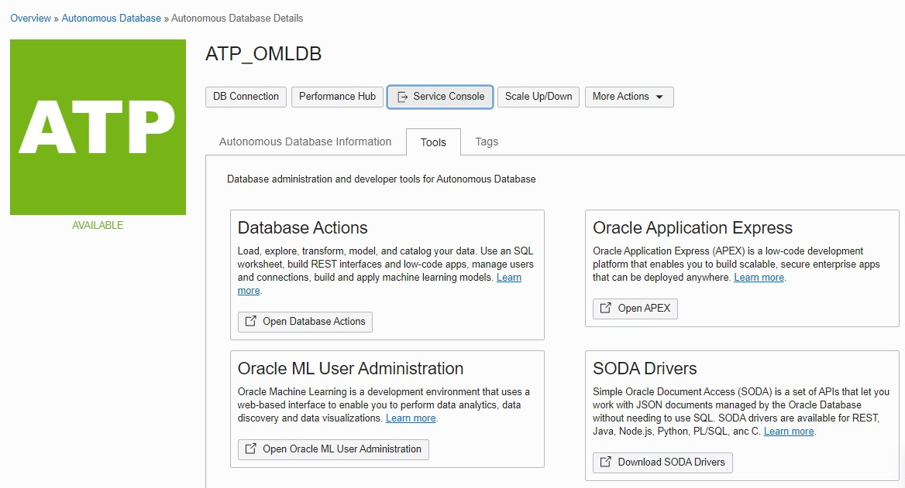

* A new page with the service console is opened. In the Overview section we see the details of this specific instance. We can go to the Development section in the left side.
  

* In the Development section, notice the **Oracle Machine Learning RESTful services** section.
  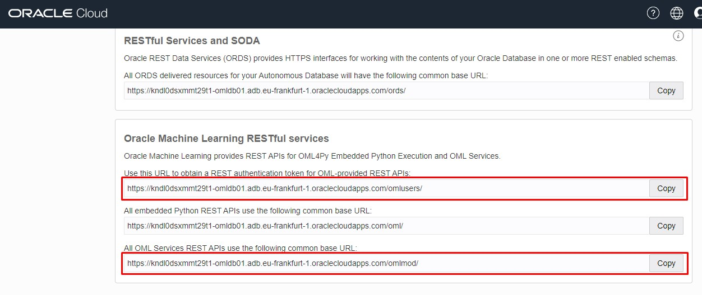

  Note 2 important URLs from this section:
  + The URL to obtain a REST authentication token for OML-provided REST APIs:
  `https://<oml-cloud-service-location-url>.oraclecloudapps.com/omlusers/`

  + All OML Services REST APIs use the following common base URL:
  `https://<oml-cloud-service-location-url>.oraclecloudapps.com/omlmod/`


* Click on Oracle Machine Learning Notebooks.
  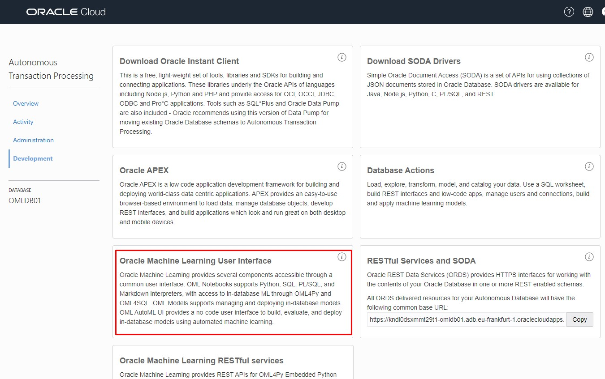

* Connect to OML Machine Learning Notebooks in Autonomous Database

  Access the OML Machine Learning Notebooks link and connect with the credentials that we created earlier. In our case the credentials are:

   - Username: **OMLUSER**
   - Password: **Welcome12345**

   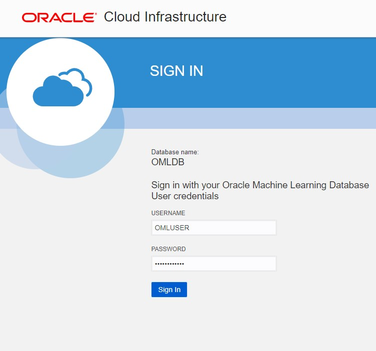

* Open a Scratchpad

  


* The notebook server is starting. Once opened we can run a select on the ``CUSTOMER_INSURANCE`` table
    ````
    <copy> select * from customer_insurance;  </copy>
    ````

    

 Notice the columns ``LTV`` and ``LTV_BIN`` when you scroll to the right. These are our targets for the machine learning.

* Drop training and test tables if they exist

    ````
    <copy> %script
    DROP TABLE Customer_insurance_train_classification;

    DROP TABLE Customer_insurance_test_classification;
    </copy>
    ````
    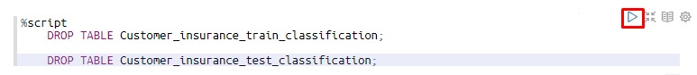

    If the tables don't exist, the script will return an error. We will create the tables in the next steps

 * Create the training table for our Auto ML UI

    ````
    <copy>
    %script
    create table Customer_insurance_train_classification as
    select CUST_ID,"LAST","FIRST","STATE","REGION","SEX","PROFESSION","BUY_INSURANCE","AGE","HAS_CHILDREN","SALARY","N_OF_DEPENDENTS","CAR_OWNERSHIP","HOUSE_OWNERSHIP","TIME_AS_CUSTOMER","MARITAL_STATUS","CREDIT_BALANCE","BANK_FUNDS","CHECKING_AMOUNT","MONEY_MONTLY_OVERDRAWN","T_AMOUNT_AUTOM_PAYMENTS","MONTHLY_CHECKS_WRITTEN","MORTGAGE_AMOUNT","N_TRANS_ATM","N_MORTGAGES","N_TRANS_TELLER","CREDIT_CARD_LIMITS","N_TRANS_KIOSK","N_TRANS_WEB_BANK","LTV_BIN"
    from customer_insurance
    SAMPLE (85) SEED (1)
    where cust_id not in ('CU12350','CU12331', 'CU12286')
    </copy>
    ````
    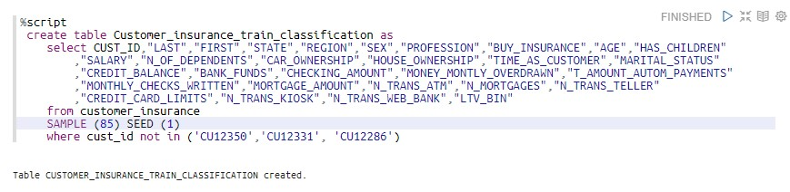

    Notice that we skip the ``LTV`` column so it would not influence the results. We keep the ``LTV_BIN`` column to be the target for learning.
    Our goal is to learn how customers are classified in the 4 groups, that are the ``LTV_BIN`` groups. For this particular workshop we leave outside 3 specific customers so we can use them to demo the test of our models.


* Create the test table for our Auto ML UI

    ````
    <copy>%script
    create table Customer_insurance_test_classification as
    select CUST_ID,"LAST","FIRST","STATE","REGION","SEX","PROFESSION","BUY_INSURANCE","AGE","HAS_CHILDREN","SALARY","N_OF_DEPENDENTS","CAR_OWNERSHIP","HOUSE_OWNERSHIP","TIME_AS_CUSTOMER","MARITAL_STATUS","CREDIT_BALANCE","BANK_FUNDS","CHECKING_AMOUNT","MONEY_MONTLY_OVERDRAWN","T_AMOUNT_AUTOM_PAYMENTS","MONTHLY_CHECKS_WRITTEN","MORTGAGE_AMOUNT","N_TRANS_ATM","N_MORTGAGES","N_TRANS_TELLER","CREDIT_CARD_LIMITS","N_TRANS_KIOSK","N_TRANS_WEB_BANK"
    from customer_insurance
    minus
    select CUST_ID,"LAST","FIRST","STATE","REGION","SEX","PROFESSION","BUY_INSURANCE","AGE","HAS_CHILDREN","SALARY","N_OF_DEPENDENTS","CAR_OWNERSHIP","HOUSE_OWNERSHIP","TIME_AS_CUSTOMER","MARITAL_STATUS","CREDIT_BALANCE","BANK_FUNDS","CHECKING_AMOUNT","MONEY_MONTLY_OVERDRAWN","T_AMOUNT_AUTOM_PAYMENTS","MONTHLY_CHECKS_WRITTEN","MORTGAGE_AMOUNT","N_TRANS_ATM","N_MORTGAGES","N_TRANS_TELLER","CREDIT_CARD_LIMITS","N_TRANS_KIOSK","N_TRANS_WEB_BANK" from Customer_insurance_train_classification
    </copy>
    ````
    

    Notice that in the testing table we will not use any of the leading ``LTV`` or ``LTV_BIN`` columns. These column might be misleading in the process. We will still use them in our verification process.


## Task 2: Use AutoML UI from Autonomous Database

* Go to the Main menu on the top left side near the Oracle Machine Learning icon.


* Choose AutoML.


* Click Create in the AutoML Experiments page


* In the Create Experiment page choose the following details:

    - Name: **AutoML Classification**
    - Data Source: chose the **CUSTOMER\_INSURANCE\_TRAIN\_CLASSIFICATION** table in the OMLUSER schema.
    - Predict: **LTV_BIN**
    - Prediction Type: **CLASSIFICATION**
    - Case ID: **CUST_ID**

    

* To make some customizations you can expand the Additional Settings menu

    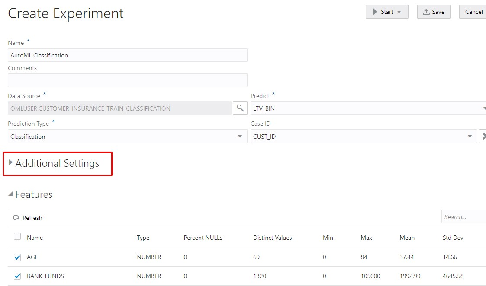

    Notice that we can choose the Database Service Level to High, and select by which metric should we compare the algorithms, and which predefined algorithms to include or exclude from this experiment.

      - Choose the following options for your experiment:

        - Database Service Level: **High**
        - Model Metric: **F1**
        - Weight Option: **Weighted**

    

    The F1 score is the harmonic mean of the precision and recall; where the precision is the number of true positive results divided by the number of all positive results, including those not identified correctly, and the recall is the number of true positive results divided by the number of all samples that should have been identified as positive. Precision is also known as positive predictive value, and recall is also known as sensitivity in diagnostic binary classification.

    **F1-score = 2 × (precision × recall)/(precision + recall)**

    

* Run the Auto ML for classification by clicking **```Start```** and **```Better Accuracy```**.

  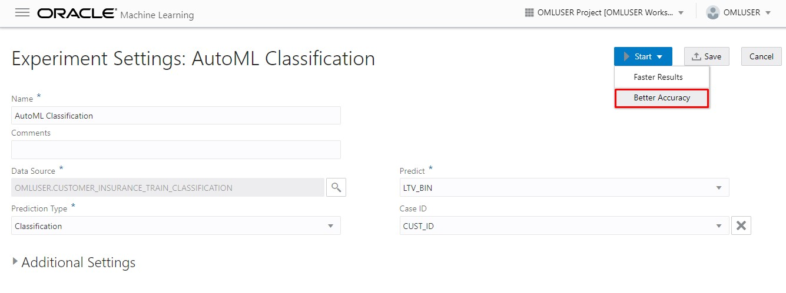

  The AutoML Classification will run for several minutes showing which top 5 algorithms have a higher Balanced Accuracy. The running process takes around 10 minutes.

* And the result of the Auto ML Classification

  

  Each model described here is based on an algorithm and ran against our training data. We can click on the model name and see its details.

  

  The model detail window opens and the first tab is Prediction Impacts.

  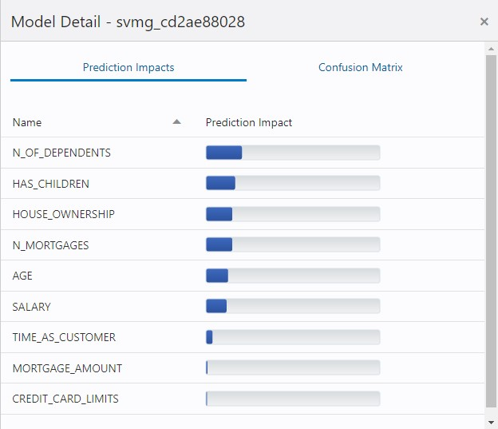

  Notice how the other table columns impact differently our model and which column has a higher weight in it. We can click on the Confusion Matrix tab.

  

  There we can see for each class: **LOW**, **MEDIUM**, **HIGH**, **VERY HIGH** what percentage of customers are actually in that class and what percentage are predicted to be in that class.

* We can rename the Support Vector Machine model so it would be easier to recognize in the next sections. For this we can select the model and click on the Rename button.

  

* Enter a new Model Name and click OK. In our case we are going to use **SVMG**.

  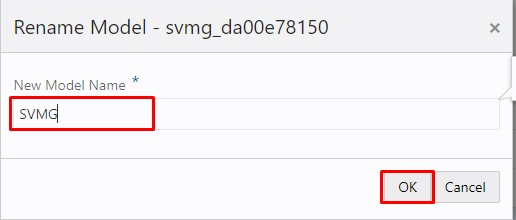

* The model is now renamed in the results page also.

  


## Task 3: Deploy the model for REST API access using OML Services

The next steps would be to take a model and deploy it for OML Services Rest API access.

* Go to the Main menu on the top left side near the Oracle Machine Learning icon.
  

* Choose Models.
  

* We see the list of models created by the AutoML UI with their specific algorithm and target value.
  

* Click on the the  **SVMG** model based on the **Support Vector Machines Gaussian** algorithm and click Deploy. It is a powerful classification algorithm with very high F1 score

  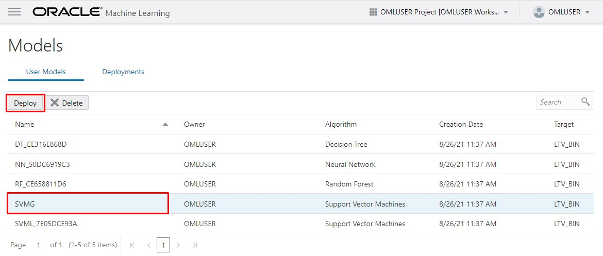


  Enter the following details.


    - Name: is prefilled with the Model name.
    - URI: choose a specific URI, for example: **classsvmg**
    - Version: **1**


  Copy the Model URI in a accessible place because we are going to use it in the next sections of the workshop.

  Click OK.

  

  The model will be deployed and a green banner will show the success of the deployment.

  

* In the Deployment tab you can see the model and URI

  

  We can now use REST APIs to query the model, model scoring and scoring for specific data.


## Task 4: Verify the classification prediction

  * Return to the OML Notebook Scratchpad we created earlier. Click on the menu and chose Notebooks.
  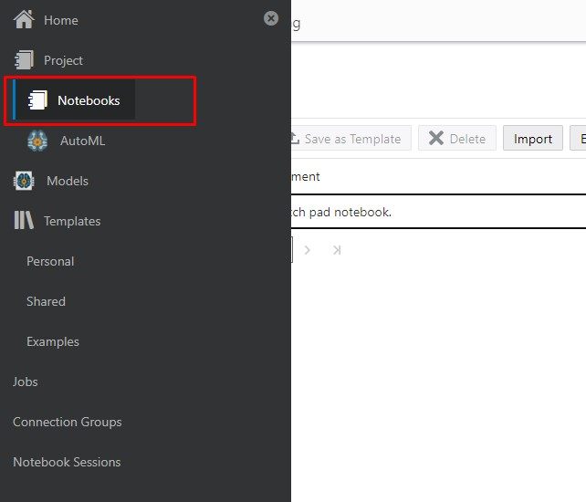


  * Click on the Scratchpad notebook.
    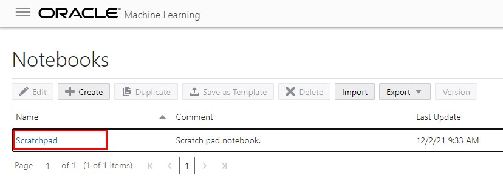


  * Run the following SQL statement using the ``CUST_IDs`` we picked in the train test split. You can replace the model name with the one used previously.

     ````
     <copy>%sql
      SELECT a.cust_id,
            a. Last,
            a.First,
            PREDICTION(SVMG USING a.*) PREDICTION,
            PREDICTION_PROBABILITY(SVMG USING a.*)
            PREDICTION_PROBABILITY,
            b.LTV_BIN
      FROM Customer_insurance_test_classification a,
      Customer_insurance b
     where a.cust_id = b.cust_id
     and b.cust_id in ('CU12350','CU12331', 'CU12286')
     </copy>
     ````

  

 In SQL statement it is returned the most probable group or class for the data provided. In out case the prediction is the same as the actual ``LTB_BIN`` column in ``CUSTOMER_INSURANCE`` initial table.

## Acknowledgements
* **Authors** -  Andrei Manoliu, Milton Wan
* **Contributors** - Rajeev Rumale
* **Last Updated By/Date** -  Andrei Manoliu, December 2021

## Need Help?
Please submit feedback or ask for help using our [LiveLabs Support Forum](https://community.oracle.com/tech/developers/categories/livelabsdiscussions). Please click the **Log In** button and login using your Oracle Account. Click the **Ask A Question** button to the left to start a *New Discussion* or *Ask a Question*.  Please include your workshop name and lab name.  You can also include screenshots and attach files.  Engage directly with the author of the workshop.

If you do not have an Oracle Account, click [here](https://profile.oracle.com/myprofile/account/create-account.jspx) to create one.
