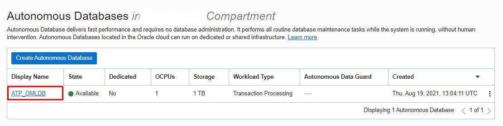
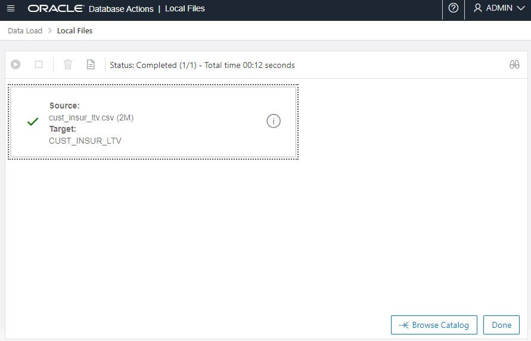
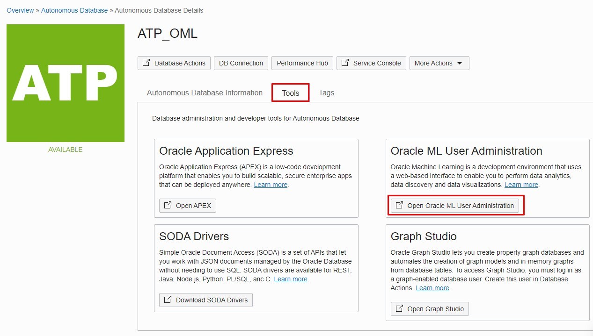
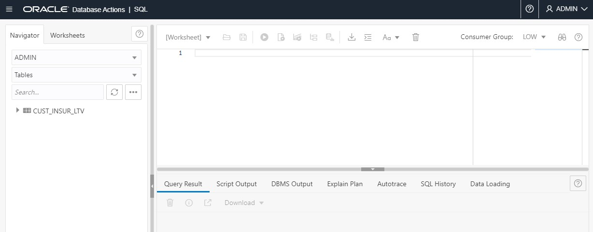

# Load and Prepare Data

## Introduction

In this lab we will start from a newly created Oracle Autonomous Database instance and prepare it the workshop.

 You will collect the connection details like Tenancy ID, database name, create the users and passwords. After you will load the data into Autonomous Database and prepare to use it in Oracle Machine Learning Notebooks.


Estimated Lab Time: 15 minutes

### Objectives
*	Get the Tenancy ID.
*	Get Autonomous Database dbname
* Load data into ADB
*	Create the OMLUSER user
* Move the data in OMLUSER schema


### Prerequisites
* Oracle Cloud Infrastructure (OCI) account
* Autonomous Database deployed in Oracle Cloud


### Lab Preparation:


## Task 1: Loading the data

* Connect to the Oracle Cloud Infrastructure (OCI) Console and go to Autonomous Database home page.
* Click on the target Autonomous Database instance


* In the Autonomous Database instance detail page, click on the Database Actions button.


* When prompted, enter the **Admin** username.


* When prompted, enter the password for the Admin user and click Sign in.


* The Database Actions launchpad page is now open. Here we have multiple tools available to easily manage and use the database, develop new applications or REST modules or manage data inside the database.

 We will choose Data Load option in the Data Tools category.


* In the Data Load menu, chose Load Data and Local File and click Next.


* Download the [cust\_insur\_ltv.csv](https://objectstorage.eu-frankfurt-1.oraclecloud.com/p/NIPrIgDVBKsOBi_xnF5_ZHWAnlilwwnUbrgQbUA24iupm6ryoNkvp_KZ9qywzpQE/n/oraclepartnersas/b/ADB_Stage/o/cust_insur_ltv.csv) and load it using Drag and drop or Select Files option.


* The file is parsed and an entry is displayed on the screen. We can check the settings clicking on the pencil icon.


* The Data Load settings page opens.


Notice the default options here.
 - The create table option in case the table doesn't exist.
 - The default pre-filled table name is the file name.
 - The default encoding properties to be able to read the CSV file.
 - The mapping is for the column name and for the data type

Leave the default settings and click Close.

* Click run to start the Data Load.


The data loading process takes less than a minute. When is completed notice the green check mark and click Done.


The next step is to create the OML User and to add the data in his schema.

## Task 2:  Create the OMLUSER user

* Returning in the Autonomous Database instance, click on Tools tab and click on the **Open Oracle ML User Administration**


* In the Oracle Machine Learning Database Administrator credentials page enter the username: **ADMIN** and password.


* In the Machine Learning User Administration  we see only the ADMIN user with the System Administrator role. Click on the Create button to create another user.


* In the Create User page enter the following:


    - Username: **OMLUSER**;
    - Email Address: **An email address**;
    - **Un-check**: Generate password and email the account details to user;
    - Password: Chose a password. Throughout the workshop we are using **Welcome12345** as a password for OMLUSER;
    - Confirm Password: **Retype the password**;


    Click Create.
    

* Now we have a new user named OMLUSER available.


OMLUSER is also a database user and for the moment he doesn't have access to the customer insurance data we loaded in the admin user. so the next step is to move the data in the OMLUSER schema.


## Task 3:  Move the data in OMLUSER schema

* Returning in the Autonomous Database instance .Click **Database Actions**.


* When prompted, enter the **Admin** username.


* When prompted, enter the password for the Admin user and click Sign in.


* In the Database Actions Launchpad click SQL to open SQL Developer web.


* SQL Developer web opens.


  Notice that it resembles the look and feel of the SQL Developer application. In the Left side we see the user: Admin and the table owned by the user. in our case it is just the **CUST\_INSUR\_LTV** table.

  Write the following script to create the **CUSTOMER_INSURANCE** table in OMLUSER schema and click the Run button.

    ````
    <copy>
    CREATE TABLE OMLUSER.CUSTOMER_INSURANCE
    AS
    SELECT * FROM CUST_INSUR_LTV;
    </copy>
    ````
  

* The table was created successfully.


The next step is to use this data and create an AutoML model.


## Acknowledgements
* **Authors** -  Andrei Manoliu, Milton Wan
* **Contiributors** - Rajeev Rumale, Mark Hornick, Sherry LaMonica
* **Last Updated By/Date** -  Andrei Manoliu, December 2021

## Need Help?
Please submit feedback or ask for help using our [LiveLabs Support Forum](https://community.oracle.com/tech/developers/categories/livelabsdiscussions). Please click the **Log In** button and login using your Oracle Account. Click the **Ask A Question** button to the left to start a *New Discussion* or *Ask a Question*.  Please include your workshop name and lab name.  You can also include screenshots and attach files.  Engage directly with the author of the workshop.

If you do not have an Oracle Account, click [here](https://profile.oracle.com/myprofile/account/create-account.jspx) to create one.
