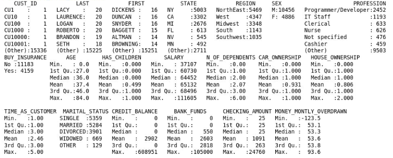

## Oracle Machine Learning for R (OML4R)

Oracle Machine Learning for R (OML4R) enables you to use R (a statistical programming language) for statistical analysis, data exploration, machine learning, and graphical analysis of data stored in an Oracle database. This allows you to benefit from the simplicity of R and the power of Oracle Database without the need to deal with the complexities of sourcing, moving, and securing data.  OML4R is the new name for Oracle R Enterprise.

In this workshop, you will use a dataset representing about 15,000 customers of an insurance company. Each customer has about 30 attributes, and the goal is to train the model to predict a given customer's life-time value (LTV) using regression algorithms, and additionally, using classification algorithms to classify customers as LOW, MEDIUM, HIGH, or VERY  HIGH LTV (using binned LTV categories). 

Note: In marketing, the life-time value (LTV) of a customer is an estimate of the net profit attributable to a given customer relationship over its lifetime.

Estimated Lab Time: 2 hours


### Objectives

In this lab, you will:

* Establish a connection from RStudio to your Oracle Database instance to prepare, explore, and visualize data.
* Use R for exploratory data analysis, data visualization, data organization (bucketing of data in train and test buckets),
* Use Attribute Importance, Principle Component Analysis, Model Building, and Model Validations techniques
* Use an OML4R Regression models for estimating customer life-time value (LTV)
* Use an OML4R Classification models for LTV_BIN assignment for unassigned customers
* Validate predictions using RMSE (Root Mean Squared Error) and Confusion Matrix methods

Note: AutoML is currently not available for OML4R (it is only available for OML4Py). AutoML UI is currently available for ADB ONLY. However, OML4R is currently not available for ADB.Therefore, we will not be using AutoML in this lab.

### Prerequisites

* Oracle Database 21c, 19c, or 18c installed on-premises (or in a VM in Cloud);
* R, RStudio, and required libraries


## Task 1: Connect to RStudio client and establish database connection

RStudio provides a GUI/BUI IDE for R. RStudio has been pre-configured on your VM running the database server.  


You will be running all the lab steps in the RStudio R Script window.

1. Point browser to RStudio Web to connect with the url below.

  ```
  http://<ip-address>:8787
  ```

  Note: Alternatively, you can use RStudio Desktop, if you prefer.  

2. Connect to RStudio with username: omluser and password: MLlearnPTS#21_


3. Load useful ORE libraries. The ORE library is a package that contains many useful R functions.

 The standard dplyr R package provides grammar of data manipulation, which gives a consistent set of verbs that help you solve the most common data manipulation challenges

 OREdplyr is an overloaded package that provides much of the dplyr functionality extending the ORE transparency layer for in-database execution of dplyr function calls. OREdplyr allows users to avoid costly movement of data while scaling to larger data volumes because operations are not constrained by R client memory, the latency of data movement, or single-threaded execution, but leverage Oracle Database as a high performance compute engine.

 The caTools package contains several basic utility functions including: moving (rolling, running) window statistic functions, read/write for GIF and ENVI binary files, fast calculation of AUC, LogitBoost classifier, base64 encoder/decoder, round-off-error-free sum and cumsum, etc.  

  ```
  library(ORE)
  library(dplyr)
  library(OREdplyr)
  library(caTools)

  ```

4. A Oracle 21c database instance (MLPDB1) has been provisioned for your to run this lab. Connect to the provided database.

  ```
  options(ore.warn.order=FALSE)
  
  ore.connect(user="oml_user",
              conn_string="MLPDB1",
              host=<hostname>,
              password=<password>,
              all=TRUE)
  ```

Note: Your database connection is to the database schema where the data resides. The connection port defaults to 1521.

By specifying “all = TRUE”, proxy objects are loaded for all tables in the target schema to which you are connecting. If needed, you can use ore.disconnect() to explicitly disconnect the database session.

Example:

  ```
  ore.connect(user="oml_user",
              conn_string="MLPDB1",
              host="130.61.185.99",
              password="MLlearnPTS#21_",
              all=TRUE)
  ```

5. Check if connection to database is established. An output of "TRUE" indicates you are connected. 

  ```
  ore.is.connected()
  ```


6. Use the ore.ls function call to list tables in the database schema you are connected to. Database tables appear as ORE frames in the output.

  ```
  ore.ls()
  ```


## Task 2: Explore data

In this section, we will do basic data exploration, looking at database objects, and try to understand the data to some extent.

7. Check class of an object (data table). The database table appears as "ore.frame". ore.frame is the R object representation of the data table.

  ```
   class(CUST_INSUR_LTV)
  ```

 8. Get column names for a table. The column names appear in an ordered list and can be referenced based on this order.

  ```
  colnames(CUST_INSUR_LTV)
  ```

  


 9. Check object dimensions. The dimensions represents the number of rows (records) and number of columns (attributes) in the given frame (table).

  ```
  dim(CUST_INSUR_LTV)
  ```

  Your result should be: 15342  31

10. Check data summary for a given object.  This will summarize all the attributes, how many, how much, minimum values, maximum values, etc. Notice the reference to the first 20 columns (attributes) of the table using the order numbers for the columns. You can specify one or more, or a range of columns to see the summary of only those columns.

  ```
  summary(CUST_INSUR_LTV[,1:20])
  ```


  


11. Statistical exploration: Check min(), max(), unique() etc. for different attributes in the given table. For example, the minimum salary in the customer base, the maximum age, the unique count of dependents, the unique list of regions, etc.

  ```
  min(CUST_INSUR_LTV$SALARY)
  max(CUST_INSUR_LTV$AGE)
  unique(CUST_INSUR_LTV$N_OF_DEPENDENTS)
  unique(CUST_INSUR_LTV$REGION)
  ```

12. Statistical exploration: Check average value in a numeric column (note that MEAN is the statistical average)

  ```
   mean(CUST_INSUR_LTV$N_OF_DEPENDENTS)
  ```

Your result should be: 2.068

13. Statistical exploration: Check MODE (i.e., the most frequently occurring observation for an attribute)

  ```
  x <- CUST_INSUR_LTV$N_OF_DEPENDENTS     
  names(table(x))[table(x)==max(table(x))]
  ```

  Your result should be: 3

14. Statistical exploration: Check percentiles (this may be useful to identify outlier limits)

  ```
  lower_bound <- quantile(CUST_INSUR_LTV$SALARY, 0.025)
  lower_bound
  upper_bound <- quantile(CUST_INSUR_LTV$SALARY, 0.975)
  upper_bound
  ```

  Your result should be:  2.5% 55158,  97.5% 88925

15. Data exploration: Group data, filter data etc.

  ```
  CUSTBIN = aggregate(CUST_INSUR_LTV$LTV_BIN, by = list(LTV_BIN = CUST_INSUR_LTV$LTV_BIN),FUN = length)
  CUSTBIN

  filter(CUST_INSUR_LTV, region == “NORTHEAST”)
  CUST_INSUR_LTV %>% filter(SALARY > mean(SALARY, na.rm = TRUE))

  ```


## Task 3: Visualize data

In this section we will try to visualize some of the data provided in the dataset. This includes drawing plots, graphs, and histograms, etc.


16. Data visualization: Plot the age attribute using box plot. This can help see the concentration of customers in specific age bands and relative number of outliers, etc.

  ``` 
  boxplot(CUST_INSUR_LTV$AGE)
  ```

A boxplot displays distribution of data based on a 5-number summary (“minimum”, first quartile (Q1), median, third quartile (Q3), and “maximum”). A boxplot makes it easy to see outliers and what their values are. It can also indicate if your data is symmetrical, general grouping of data, and data skew.

  


17: Data visualization: Simple plot of salary.

  ```
  plot(CUST_INSUR_LTV$SALARY/1000)
  ```

  

18. Data visualization: Histograms help see distribution of data / attributes in range bands. R/ORE transparently identifies what it sees as appropriate band ranges. See data in histogram, bar chart.

  ```
  hist(CUST_INSUR_LTV$SALARY/1000)
  ```

  

19. Data visualization: Check outliers on a box plot. The outlier values are listed on top as illustrated in the output.

  ```
  out <- boxplot.stats(CUST_INSUR_LTV$AGE)$out
  boxplot(CUST_INSUR_LTV$AGE, ylab = "Age")
  mtext(paste("Outliers: ", paste(unique(out), collapse = ", ")))
  ```

  


## Task 4: Perform exploratory data analysis


20. Use Attribute Importance (ore.odmAI) function to identify important attributes (listed in order of importance) for a given dependent attribute (LTV_BIN) in the given dataset. To do this we first exclude the most significant dependent attribute from the data frame.  In database terms, we are looking for the most important columns (attributes) to predict the target column (attribute).


  ```
  CIL <- CUST_INSUR_LTV
  CIL$LTV <- NULL
  dim(CIL)

  ore.odmAI(LTV_BIN ~ ., CIL)
  ```

  Note: The output lists all the important attributes and their relative influence on the target attribute. Since LTV_BIN is directly related to LTV for a customer, we excluded LTV from the data frame before running ore.odmAI.

  Your result should look like the ranking below with House Ownership as the highest importance for determine LTV_BIN, and Customer ID as the least important.

            

21. Use Attribute Importance (AI) to identify important attributes for a given dependent attribute (LTV_BIN) in the given dataset. 

AI for LTV_BIN (Exclude LTV_BIN from dataset)

  ```
  CIL <- CUST_INSUR_LTV
  CIL$LTV_BIN <- NULL
  dim(CIL)
  ore.odmAI(LTV ~ ., CIL)
  ```

  Note: Attribute importance ranks attributes according to their significance in predicting a target. 


22. Perform principal component analysis (PCA). Principal Component Analysis (PCA) is a technique used for exploratory data analysis, and to visualize the existing variation in a dataset that has several variables. PCA is particularly helpful when dealing with wide datasets (where each record has many attributes). PCA allows you to simplify a dataset by turning the original (many) variables into a smaller number of what are termed as "Principal Components".

  ```
  prc0 <- prcomp(~  HOUSE_OWNERSHIP + N_MORTGAGES + MORTGAGE_AMOUNT + AGE + SALARY + N_OF_DEPENDENTS, data = CUST_INSUR_LTV, scale. = TRUE)
  summary(prc0)
  ```
 


## Task 5: Prepare data for model creation 

23. Create row names. You can use the primary key of a database table to order an ore.frame object.

  ```
  set.seed(1)
  head(CUST_INSUR_LTV)
  CIL <- CUST_INSUR_LTV
  row.names(CIL) <- CIL$CUST_ID
  head(row.names(CIL))
  ```

  Your result should be:

  

  Note: The data in an Oracle Database table is not necessarily ordered. For some R operations, ordering is useful. By ordering an #ore.frame, you are able to index the ore.frame object by using either integer or character indexes. Using an ordered ore.frame object #that is a proxy for a SQL query can be time-consuming for a large data set. Therefore, OML4R attempts to create ordered ore.frame #objects by default.

24. Partition dataset for training and testing. Split the dataset into two buckets (training data set (~70%), and testing data set (~30%))

  ```
  set.seed(1)
  sampleSize <- 4600
  ind <- sample(1:nrow(CIL),sampleSize)
  group <- as.integer(1:nrow(CIL) %in% ind)
  CIL.train <- CIL[group==FALSE,]
  dim(CIL.train)
  class(CIL.train)
  CIL.test <- CIL[group==TRUE,]
  dim(CIL.test)
  class(CIL.test)
  ```


## Task 6: Build ML models


Use a Regression Model for LTV Prediction

25. Build regression model to predict customer LTV using the training data set

  ```
  oreFit1 <- ore.odmGLM(LTV ~ N_MORTGAGES + MORTGAGE_AMOUNT + N_OF_DEPENDENTS, data = CIL.train, ridge=TRUE)
  oreFit1 %>% print()
  class(oreFit1)
  summary(oreFit1)
  names(oreFit1)
  oreFit1$formula
  oreFit1$ridge
  ```

 Note: # Change TYPE parameter (check in ore.odmGLM doc) 


26. Generate predictions using ore.predict. The ore.predict function is invoked on a model. For example, the following code generates predictions (predA) by invoking ore.oredict on the oreFit1 model produced above and uses CIL.test dataset to score.

  ```
  predA = ore.predict(oreFit1, newdata = CIL.test)
  predA
  ```

27. Compare actual and predicted values and validate

  ```
  oreFit1 <- ore.odmGLM(LTV ~ N_MORTGAGES + MORTGAGE_AMOUNT + N_OF_DEPENDENTS, data = CIL.train, ridge=TRUE)
  CIL <- CUST_INSUR_LTV
  CIL_pred <- ore.predict(oreFit1, CIL, se.fit = TRUE, interval = "prediction")
  CIL <- cbind(CIL, CIL_pred)
  head(CIL)
  library(OREdplyr)
  head(select (CIL, LTV, PREDICTION))
  ```


 Use a Classification Model for LTV_BIN Prediction


28. Exclude highly correlated columns from the data frame

  ```
  CIL <- CUST_INSUR_LTV
  CIL$LTV_BIN <- NULL
  dim(CIL)
  ```

29. Build Classification Model using Decision Tree algorithm and the training data set for predicting customer LTV_BIN assignment.

  ```
  oreFit2 <- ore.odmDT(LTV_BIN ~ ., data = CIL.train)
  oreFit2 %>% print()
  summary(oreFit2)
  names(oreFit2)
  oreFit2$formula

30. Additionally, build a Classification Model using Naive Bayes algorithm and the training dataset for predicting customer LTV_BIN assignment.

  CIL <- CUST_INSUR_LTV
  nb <- ore.odmNB(LTV_BIN ~ N_MORTGAGES + MORTGAGE_AMOUNT + N_OF_DEPENDENTS, CIL.train)
  nb.res <- predict (nb, CIL.test, "LTV_BIN")
  head(nb.res,10)
  with(nb.res, table(LTV_BIN,PREDICTION, dnn = c("Actual","Predicted")))
  ```

  

31. Generate predictions using the new classification model and the test dataset.

  ```
  predB = ore.predict(oreFit2, newdata = CIL.test)
  predB
  ```


## Task 7: Validate predictions

32. Validate LTV predictions using RMSE (Root Mean Square Error). RMSE is a useful way to determine the extent to which a regression model is capable of integrating a dataset. The larger the difference indicates a larger gap between the predicted and observed values, which means poor regression model fit. In the same way, the smaller RMSE that indicates the better the model. Based on RMSE we can compare the two different models with each other and be able to identify which model fits the data better. There is no ideal value for RMSE as it depends on the magnitude of the measure. 

  ```
  ans <- predict(oreFit1, newdata = CIL.test, supplemental.cols = 'LTV')
  localPredictions <- ore.pull(ans)
  ore.rmse <- function (pred, obs) {
    sqrt(mean(pred-obs)^2)
  }
  ore.rmse(localPredictions$PREDICTION, localPredictions$LTV)
  ```


33. Produce confusion matrix for LTV_BIN predictions. A confusion matrix is used to describe the performance of a classification model on a test dataset for which the actual or true values are known. It is usually presented in a table format. The consusion matrix depicts TRUE POSITIVES, TRUE NEGATIVES, FALSE POSITIVES, and FALSE NEGATIVES. The accuracy is easy to calculate by computing (TP + TN / TOTAL SAMPLE SIZE).

  ```
  confusion.matrix <- table(test$LTV_BIN, predB$PREDICTION)
  dim(test$LTV_BIN)
  class(test$LTV_BIN)
  dim(predB)
  class(predB)
  confusion.matrix
  summary(confusion.matrix)
  ```

34. Observe and assess accuracy of predictions


## Acknowledgements
* **Authors** - Ravi Sharma, Pedro Torres, Milton Wan
* **Last Updated By/Date** -  Rajeev Rumale
