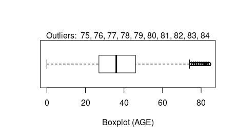

## Oracle Machine Learning for R (OML4R)

Oracle Machine Learning for R (OML4R) enables you to use R (a statistical programming language) for statistical analysis, data exploration, machine learning, and graphical analysis of data stored in an Oracle database. This allows you to benefit from the simplicity of R and the power of Oracle Database without the need to deal with the complexities of sourcing, moving, and securing data.  OML4R is the new name for Oracle R Enterprise.

In this workshop, you will use a dataset representing about 15,000 customers of an insurance company. Each customer has about 30 attributes, and the goal is to train the model to predict a given customer's life-time value (LTV) using regression algorithms, and additionally, using classification algorithms to classify customers as LOW, MEDIUM, HIGH, or VERY  HIGH LTV (using binned LTV categories). 

Note: In marketing, the life-time value (LTV) of a customer is an estimate of the net profit attributed to a given customer relationship over its lifetime.

Estimated Lab Time: 2 hours


### Objectives

In this lab, you will:

* Establish a connection from RStudio to your Oracle Database instance to prepare, explore, and visualize data.
* Use R for exploratory data analysis, data visualization, data organization (bucketing of data in train and test buckets),
* Use Attribute Importance, Principle Component Analysis, model building, and model validations techniques
* Use an OML4R Regression models for estimating customer life-time value (LTV)
* Use an OML4R Classification models for LTV_BIN assignment for unassigned customers
* Validate predictions using RMSE (Root Mean Squared Error) and Confusion Matrix methods

Note: AutoML is currently not available for OML4R (it is only available for OML4Py). AutoML UI is currently available for ADB ONLY. However, OML4R is currently not available for ADB. Therefore, we will not be using AutoML in this lab.

### Prerequisites

* Oracle Database 21c, 19c, or 18c installed on-premises (or in a VM in Cloud);
* R, RStudio Server, and required libraries


## Task 1: Connect to RStudio client and establish database connection

RStudio provides IDE for R with a GUI (Graphical User Interface) and BUI (Browser User Interface). 

Note that RStudio Server has been pre-configured on your VM running the database server.  


You will be running all the lab steps in the RStudio R Script window.

1. Point browser to RStudio Web to connect with the url below.

  ```
  http://<ip-address>:8787
  ```

  Note: Alternatively, you can use RStudio Desktop, if you prefer.  

2. Connect to RStudio with username: omluser and password: MLlearnPTS#21_


3. Load required ORE libraries. 

ORE - The ORE libraries are a set of packages that contains many useful R functions.

dplyr - The standard dplyr R package provides grammar of data manipulation, which gives a consistent set of verbs that help you solve the most common data manipulation challenges

OREdplyr - The OREdplyr package is an overloaded package that provides much of the dplyr functionality extending the ORE transparency layer for in-database execution of dplyr function calls. OREdplyr allows users to avoid costly movement of data while scaling to larger data volumes. Using the transparency layer operations are not constrained by R client memory, the latency of data movement, or single-threaded execution. The transparency layer allows leveraging of the Oracle Database as a high performance compute engine.

caTools - The caTools package contains several basic utility functions including: moving (rolling, running) window statistic functions, read/write for GIF and ENVI binary files, fast calculation of AUC, LogitBoost classifier, base64 encoder/decoder, round-off-error-free sum and cumsum, etc.  

  ```
  library(ORE)
  library(dplyr)
  library(OREdplyr)
  library(caTools)
  
  ```

4. Set ore.warn.order global option to disable unnecessary warnings.

Oracle Machine Learning for R provides the ability to create ordered or unordered ore.frame objects. Using an ordered ore.frame object that is a proxy for a SQL query can be time-consuming for a large data set. Therefore, although OML4R attempts to create ordered ore.frame objects by default, it also provides the means of creating an unordered ore.frame object. 

The ore.warn.order global option specifies whether you want OML4R to display a warning message if you use an unordered ore.frame object in a function that requires ordering. If you know what to expect in an operation, then you might want to turn the warnings off so they do not appear in the output. 


  ```
  options(ore.warn.order=FALSE)
  ```


5. Connect from your R Client to the Oracle Database.

An Oracle 21c database instance (MLPDB1) has been provisioned for your to run this lab. Connect to the provided database using the ore.connect() function.
  
  ```
  ore.connect(user="oml_user",
              conn_string="MLPDB1",
              host=<hostname>,
              password=<password>,
              all=TRUE)
  ```

Note: Your database connection is to the database schema where the data resides. The connection port defaults to 1521.

By specifying “all = TRUE”, proxy objects are loaded for all tables in the target schema to which you are connecting. 

Example:

  ```
  ore.connect(user="oml_user",
              conn_string="MLPDB1",
              host="130.61.185.99",
              password="MLlearnPTS#21_",
              all=TRUE)
  ```
  
  If needed, you can use ore.disconnect() to explicitly disconnect the database session.


6. Check if connection to database is established. 


  ```
  ore.is.connected()
  ```
  
  An output of "TRUE" indicates you are connected. Otherwise, it returns "FALSE" as the output.


7. List OML4R proxy object for the schema you are connected to.

The ore.ls() function returns all OML4R proxy objects. Use the ore.ls() function call to list tables in the database schema you are connected to, which appear as ore frames in your OML4R session. The conversion is transparent and enabled by the OML4R transparency layer.

  ```
  ore.ls()
  ```


## Task 2: Explore data

In this section, we will do basic data exploration, look at database objects, and try to develop basic understanding of the target dataset.

8. Data Exploration: Check class of an object (data table). 


  ```
   class(CUST_INSUR_LTV)
  ```
  
  The database table appears as "ore.frame". An ore.frame is the R object representation of the data table.


 9. Data Exploration: Get column names (attributes) for a table.

  ```
  colnames(CUST_INSUR_LTV)
  ```
  
  The column names appear in an ordered list and can be referenced based on this order.

  


 10. Data Exploration: Check object dimensions. 

  ```
  dim(CUST_INSUR_LTV)
  ```
  
  The dimensions represents the number of rows (i.e., records or observations ) and number of columns (or attributes) in the given frame (table).

  Your result should be: "15342  31", which means there are 15342 records (rows) in the table and each record has 31 attributes (columns).

11. Data Exploration: Check data summary for a given object. 

You can also specify one or more, or a range of columns to see the summary of only those columns.

  ```
  summary(CUST_INSUR_LTV[,8:31])
  
  ```
  
  The "summary" command summarizes all the attributes, how many, how much, minimum values, maximum values, etc. Notice the reference to the given columns (attributes) of the table using the order numbers for the columns.


  


12. Data Exploration: Perform basic statistical exploration.

Check min(), max(), mean(), median() etc. for various attributes in the given table. 


  ```
  min(CUST_INSUR_LTV$SALARY)
  max(CUST_INSUR_LTV$AGE)
  mean(CUST_INSUR_LTV$SALARY)
  mean(CUST_INSUR_LTV$N_OF_DEPENDENTS)
  median(CUST_INSUR_LTV$AGE)
  
  mean(CUST_INSUR_LTV$LTV)
  
  ```
  
  Note that knowing the actual mean (average) LTV for the dataset will be useful later for reference purposes. You results should show a mean LTV of 22266.67.

13. Data Exploration: Perform more statistical exploration.

Statistical exploration: Check ranges and unique values.

  ```
  range(CUST_INSUR_LTV$AGE)
  range(CUST_INSUR_LTV$MONTHLY_CHECKS_WRITTEN)
  range(CUST_INSUR_LTV$BANK_FUNDS)
  
  unique(CUST_INSUR_LTV$N_OF_DEPENDENTS)
  unique(CUST_INSUR_LTV$REGION)
     
  ```


14. Data Exploration: Check MODE for the N_OF_DEPENDENTS attribute (i.e., the most frequently occurring observation for this attribute)

  ```
  x <- CUST_INSUR_LTV$N_OF_DEPENDENTS     
  names(table(x))[table(x)==max(table(x))]
  ```

  Your result should be: 3. This indicates that most number of customers have three dependents.

15. Data Exploration: : Check quantiles for the given dataset. 

This may be useful to identify outlier limits. The generic function 'quantile()' produces sample quantiles corresponding to the given probabilities. The smallest observation corresponds to a probability of 0 and the largest to a probability of 1.

  ```
  quantile(CUST_INSUR_LTV$SALARY, 0.025)
  
  quantile(CUST_INSUR_LTV$SALARY, 0.975)
  
  ```

Your result should be:  2.5% 55158,  97.5% 88925. Measurements like these can sometimes be used to set outlier limits for the dataset.

16. Data Exploration: Check aggregate data for given attributes.

The 'aggregate' function allows for grouping of data by a list of columns.

  ```
  
  aggregate(CUST_INSUR_LTV$LTV_BIN, by = list(LTV_BIN = CUST_INSUR_LTV$LTV_BIN),FUN = length)
  
  ```

17. Data Exploration: Filter data based on a criteria. 

The 'filter' function allows for filtering of the dataset based on attribute values. 


  ```
  filter(CUST_INSUR_LTV, REGION == "NorthEast")

  filter(CUST_INSUR_LTV, SALARY > 110000)

  CUST_INSUR_LTV %>% filter(SALARY > mean(SALARY, na.rm = TRUE))

  ```

Note that the 'na.rm' specification directs treatment of non-available measurements. 'na.rm = TRUE' removes missing values from the dataset if they are coded as NA.


## Task 3: Visualize data

In this section you will try to visualize the data provided in the dataset using plots, graphs, and histograms, etc.

18. Data Visualization: Plot the age attribute using a simple boxplot. 

A simple boxplot can help you quickly see the concentration of customers in specific bands.

  ``` 
  boxplot(CUST_INSUR_LTV$AGE)
  ```

A boxplot displays distribution of data based on a 5-number summary (“minimum”, first quartile (Q1), median, third quartile (Q3), and “maximum”). A boxplot makes it easy to see outliers and what their values are. It can also indicate if your data is symmetrical, general grouping of data, and data skew.

  


19: Data Visualization: Draw a simple and quick plot of customer salary. 

This basic plot illustrates the overall distribution of cusomer's salary and the range within which it falls. You clearly see a dense band where most customers fall between about $50K to about $80K.

  ```
  plot(CUST_INSUR_LTV$SALARY/1000)
  ```

  

20. Data Visualization: Plot a more marked up histogram for customer salary data.

Histograms help see distribution of data in range bands. Note, R / ORE transparently identifies what it sees as appropriate band ranges. 

  ```
     hist(CUST_INSUR_LTV$SALARY/1000,
     main="Customer Salary Data",
     xlab="Salary($K)",
     xlim=c(40,100),
     col="darkmagenta",
     freq=TRUE)
  ```

  

21. Data Visualization: Check outliers on a boxplot.

Notice, the outlier values are listed on top of the displayed box in the output.

  ```
  x <- CIL$AGE
  boxplot(x, horizontal = TRUE, axes = TRUE, steplewex = 1) 
  text(x=fivenum(x), labels = fivenum(x), y=1.35)
  mtext(paste("Outliers: ", paste(unique(out), collapse = ", ")))
  ```

  


The above boxplot illustrates the distribution of data with a smallest (not minimum) value of 0, a highest (not maximum) value of 74, and an interquartile range from 27 to 46, with a median right in the center of these two (at 36) as depicted by the solid line. Values ranging from 75 to 84 are shown as outliers. 

22. Data Visualization: Draw a pie chart.


 ```
 
 pie(table(CUST_INSUR_LTV$REGION), main = "Customer Distribution Across Regions", clockwise = TRUE)  
 
 ```

  


## Task 4: Perform exploratory data analysis


23. Use Attribute Importance to identify attributes of high relevance in predicting target dependent variable.

The ore.odmAI() function can be used to run Attribute Importnace on the given dataset. This helps identify attributes in the given dataset that are important in predicting the given dependent attribute (LTV_BIN in this case). 

In order to use the ore.odmAI() function effectively, you should first exclude the most significant dependent attributes from the data frame. For example, exclude LTV attribute when predicting LTV_BIN and exclude LTV_BIN when predicting LTV.

Assess attribute importance for dependent variable LTV_BIN. As you know that LTV_BIN is highly correlated with LTV. Thus first exclude LTV from the data frame.

  ```
  CIL <- CUST_INSUR_LTV
  CIL$LTV <- NULL
  dim(CIL)
  ```

Notice the dimensions now show (15342 30), and not (15342 31) as was originally the case. Now let us run the odmAI function to identify ordered importance of attribute for target variable LTV_BIN.

  ```
  ore.odmAI(LTV_BIN ~ ., CIL)
  ```

Note: The output lists all the important attributes and their relative influence on the target attribute (LTV_BIN). 

Your result should look like the ranking below with House Ownership as the highest importance for determine LTV_BIN, and Customer ID as the least important.

             


24. Use Attribute Importance (AI) to identify important attributes for a given dependent attribute (LTV) in the given dataset. 

Attribute importance ranks attributes according to their significance in predicting a target. ore.odmAI produces a ranking of attributes and their importance values. 

Note: The ore.odmAI models differ from Oracle Data Mining AI models in these ways: a model object is not retained, and an R model object is not returned. Only the importance ranking created by the model is returned.

  ```
  CIL <- CUST_INSUR_LTV
  CIL$LTV_BIN <- NULL
  dim(CIL)
  ore.odmAI(LTV ~ ., CIL)
  ```

As seen below, Attribute Importance (AI) ranks attributes according to their significance in predicting a target. 

         


25. Perform Principal Component Analysis (PCA). 

Principal Component Analysis (PCA) is a technique used for exploratory data analysis, and to visualize the existing variation in a dataset that has several variables. PCA is particularly helpful when dealing with wide datasets (where each record has many attributes). PCA allows you to simplify a dataset by turning the original (many) variables into a smaller number of what are termed as "Principal Components".

  ```
  prc0 <- prcomp(~  HOUSE_OWNERSHIP + N_MORTGAGES + MORTGAGE_AMOUNT + AGE + SALARY + N_OF_DEPENDENTS, data = CUST_INSUR_LTV, scale. = TRUE)
  summary(prc0)
  ```
 
 

The above output illistrates the relative significance of the principal components used from the dataset.


  ## Task 5: Build REGRESSION MODEL for LTV Prediction

26. Create ordered ore.frame using row names.

Use the primary key of a database table to order an ore.frame object. 

The set.seed() function sets the seed of R‘s random number generator, which is useful for creating simulations or random objects that can be reproduced.

This example ensures that CUST_INSUR_LTV is an ordered ore.frame by assigning the values of the CUST_ID column as the row names of CUST_INSUR_LTV.

  ```
  set.seed(1)
  head(CUST_INSUR_LTV)
  CIL <- CUST_INSUR_LTV
  row.names(CIL) <- CIL$CUST_ID
  head(row.names(CIL))
  ```

  Your result should be:

  

Note: Using an ordered ore.frame object that is a proxy for a SQL query can be time-consuming for a large data set. Therefore, although OML4R attempts to create ordered ore.frame objects by default, it also provides the means of creating an unordered ore.frame object. 


27. Partition the original dataset for training and testing purposes. 

Split the dataset into two buckets - training data set (~70%), and testing data set (~30%). 

The 'seed' can be set to any value. Setting a 'seed' ensures the same output is reproduced by the R psuedonumber generator, if your run the code again. This can be helpful for consistency and debugging purposes. 

  ```
  set.seed(1)
  sampleSize <- 4600
  ind <- sample(1:nrow(CIL),sampleSize)
  group <- as.integer(1:nrow(CIL) %in% ind)
  CIL.train <- CIL[group==FALSE,]
  dim(CIL.train)
  class(CIL.train)
  CIL.test <- CIL[group==TRUE,]
  dim(CIL.test)
  class(CIL.test)
  ```

28. Build a REGRESSION MODEL to predict customer LTV using the training data set.

  ```
  oreFit1A <- ore.odmGLM(LTV ~ HOUSE_OWNERSHIP + N_MORTGAGES + MORTGAGE_AMOUNT + N_TRANS_WEB_BANK + N_OF_DEPENDENTS, data = CIL.train, ridge=TRUE)
  
  oreFit1A %>% print()

  ```

29. Check the REGRESSION MODEL just created.

  ```
  class(oreFit1A)
  
  summary(oreFit1A)

  names(oreFit1A)
  
  oreFit1A$formula
  
  oreFit1A$ridge
  
  head(oreFit1A$residuals)
  ```

30. Generate LTV predictions using ore.predict. 

The ore.predict function is invoked on a model. For example, the following code generates predictions (predA) by invoking ore.oredict on the oreFit1 model produced above and uses CIL.test dataset to score.

  ```
  pred1A = ore.predict(oreFit1A, newdata = CIL.test)
  
  head(pred1A)
  ```

31. Check Root Mean Squared Error (RMSE) to assess prediction accuracy.

  ```
  ans <- predict(oreFit1A, newdata = CIL.test, supplemental.cols = 'LTV')
  localPredictions <- ore.pull(ans)
  ore.rmse <- function (pred, obs) {
  sqrt(mean(pred-obs)^2)
  }

  ore.rmse(localPredictions$PREDICTION, localPredictions$LTV)
  ```

32. Compare actual and predicted values and validate

  ```
  CIL_pred <- ore.predict(oreFit1A, CIL, se.fit = TRUE, interval = "prediction")
  CIL <- cbind(CIL, CIL_pred)
  head(select (CIL, LTV, PREDICTION))
  ```

## Task 6: Build CLASSIFICATION MODEL for LTV_BIN Prediction

33. Create ordered ore.frame using row names.

Use the primary key of a database table to order an ore.frame object. 

The set.seed() function sets the seed of R‘s random number generator, which is useful for creating simulations or random objects that can be reproduced.

This example ensures that CUST_INSUR_LTV is an ordered ore.frame by assigning the values of the CUST_ID column as the row names of CUST_INSUR_LTV.

  ```
  set.seed(1)
  head(CUST_INSUR_LTV)
  CIL <- CUST_INSUR_LTV
  row.names(CIL) <- CIL$CUST_ID
  head(row.names(CIL))
  ```

  Your result should be:

  

Note: Using an ordered ore.frame object that is a proxy for a SQL query can be time-consuming for a large data set. Therefore, although OML4R attempts to create ordered ore.frame objects by default, it also provides the means of creating an unordered ore.frame object. 


34. Partition the original dataset for training and testing purposes. 

Split the dataset into two buckets - training data set (~70%), and testing data set (~30%). 

The 'seed' can be set to any value. Setting a 'seed' ensures the same output is reproduced by the R psuedonumber generator, if your run the code again. This can be helpful for consistency and debugging purposes. 

  ```
  set.seed(1)
  sampleSize <- 4600
  ind <- sample(1:nrow(CIL),sampleSize)
  group <- as.integer(1:nrow(CIL) %in% ind)
  CIL.train <- CIL[group==FALSE,]
  dim(CIL.train)
  class(CIL.train)
  CIL.test <- CIL[group==TRUE,]
  dim(CIL.test)
  class(CIL.test)
  ```


35. Build a CLASIFICATION MODEL using NAIVE BAYES algorithm and the training data set for predicting customer LTV_BIN assignment.

  ```
  oreFit2A <- ore.odmNB(LTV_BIN ~ HOUSE_OWNERSHIP + N_MORTGAGES + MORTGAGE_AMOUNT + N_TRANS_WEB_BANK + N_OF_DEPENDENTS, data = CIL.train)
  
  oreFit2A %>% print()
  summary(oreFit2A)
  names(oreFit2A)
  oreFit2A$formula
  ```

36. Check the classification model created above

```
  summary(oreFit2A)
  
  names(oreFit2A)
  
  oreFit2A$formula
  ```


37. Generate predictions using the new classification model and the test dataset.

  ```
  predB = ore.predict(oreFit2A, newdata = CIL.test)
  
  predB
  ```


38.  Now, let us look at the confusion matrix to compare the aggregate predictions with actual data.
  
  ```
  with(oreFit3.res, table(LTV_BIN,PREDICTION, dnn = c("Actual","Predicted")))
  ```

  


  ## Task 7: Validate predictions


39. Validate LTV predictions using RMSE (Root Mean Square Error). 

RMSE is a useful way to determine the extent to which a regression model is capable of integrating a dataset. The larger the difference indicates a larger gap between the predicted and observed values, which means poor regression model fit. In the same way, the smaller RMSE that indicates the better the model. Based on RMSE we can compare the two different models with each other and be able to identify which model fits the data better. There is no ideal value for RMSE as it depends on the magnitude of the measure. 

  ```
  ans <- predict(oreFit1A, newdata = CIL.test, supplemental.cols = 'LTV')
  localPredictions <- ore.pull(ans)
  ore.rmse <- function (pred, obs) {
    sqrt(mean(pred-obs)^2)
  }
  ore.rmse(localPredictions$PREDICTION, localPredictions$LTV)
  ```


40. Produce confusion matrix for LTV_BIN predictions. 

A confusion matrix is used to describe the performance of a classification model on a test dataset for which the actual or true values are known. It is usually presented in a table format. The consusion matrix depicts TRUE POSITIVES, TRUE NEGATIVES, FALSE POSITIVES, and FALSE NEGATIVES. The accuracy is easy to calculate by computing (TP + TN / TOTAL SAMPLE SIZE).

  ```
  confusion.matrix <- table(test$LTV_BIN, predB$PREDICTION)
  dim(test$LTV_BIN)
  class(test$LTV_BIN)
  dim(predB)
  class(predB)
  confusion.matrix
  summary(confusion.matrix)
  ```

  ## Task 8: Use embedded R execution

Some of the most significant benefits of using OML4R can be derived from using Embedded R execution in your applications. Embedded R allows you to store and run R scripts in the database through either an R interface or a SQL interface, or both the interfaces. 

41. Create an Embedded R function.


```
test <- function() {
  library(ORE)
  ore.connect(user="oml_user",
              conn_string="MLPDB1",
              host="rinst5d",
              password="oml_user",
              all=TRUE)
  CIL <- ore.pull(CUST_INSUR_LTV)
  row.names(CIL) <- CIL$CUST_ID
  sampleSize <- 4600 
  set.seed(1) 
  ind <- sample(1:nrow(CIL),sampleSize) 
  group <- as.integer(1:nrow(CIL) %in% ind) 
  CIL.test <- CIL[group==TRUE,] 
  CIL.train <- CIL[group==FALSE,] 
  glmfit1 <- glm(LTV ~ N_MORTGAGES + MORTGAGE_AMOUNT + N_OF_DEPENDENTS, data = CIL.train)
  pred <- predict(glmfit1, newdata = CIL.test)
  pred 
}

```

Note: The above example function performs a number of steps including preparing the data, building the machine learning model, and then using it predict the target attribute. Many times all this may be unnecessary if all you want to do it to load and use a pre-build machine learning model, already stored in the database.

Now, check the predicted values. You can of course, use it in different ways in an application.


42. Check prediction results.

```
res <- ore.doEval(FUN=test)
res

```

43. Conclusion

As you can see, OML4R makes it fast and easy to apply Machine Learning to database resident data. Further, OML4R is able to leverage database compute power, data and task parallism, and security features to work efficiently and securely on enterprise data. By applying Machine Learning algorithms to their data residing in Oracle Databases, businesses are able to quickly create significant value.

This is the end of this workshop.


## Acknowledgements
* **Authors** - Ravi Sharma, Pedro Torres, Milton Wan
* **Last Updated By/Date** -  Rajeev Rumale


